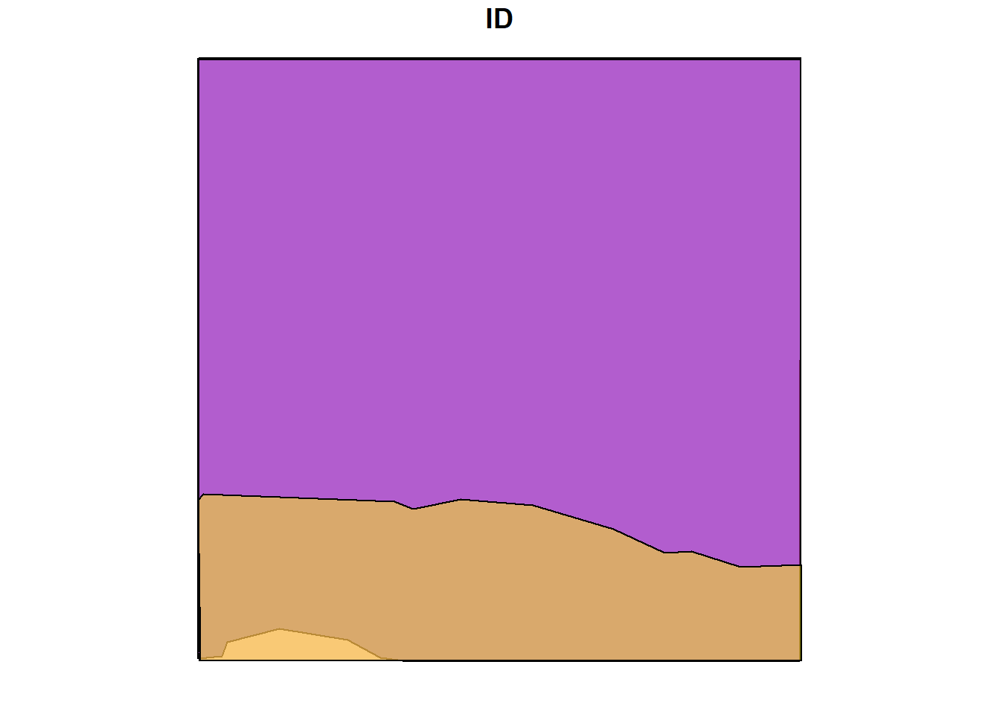
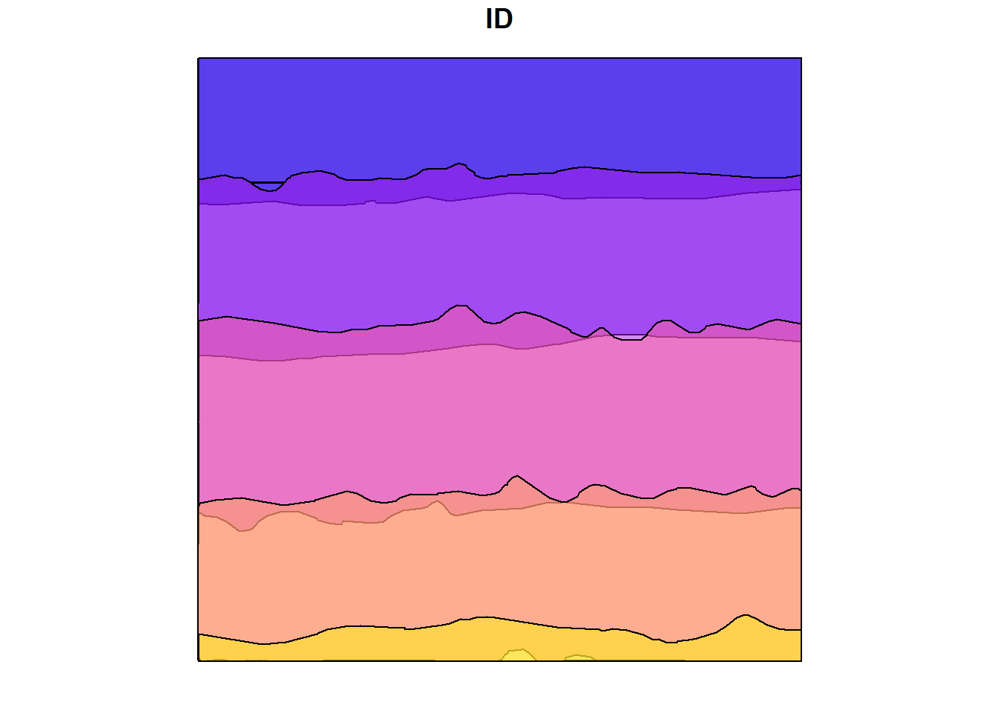

---


title: "Excercise Solutions"


---


::: {.cell}

:::


## 1-LAS


::: {.cell layout-align="center"}

```{.r .cell-code}


library(lidR)


library(sf)


library(terra)

```
:::


#### E1. 


What are withheld points? Where are they in our pointcloud?


According to ASPRS LAS specification http://www.asprs.org/wp-content/uploads/2019/07/LAS_1_4_r15.pdf page 18 "a point that should not be included in processing (synonymous with Deleted)"


They are on the edges. It looks like they correspond to a buffer. LAStools makes use of the withheld bit to flag some points. Without more information on former processing step it is hard to say.


#### E2.


Read the file dropping the withheld points.


::: {.cell layout-align="center"}

```{.r .cell-code}


#| code-fold: true


las <- readLAS("data/MixedEucaNat_normalized.laz", filter = "-drop_withheld")


plot(las)

```
:::


#### E3. 


The withheld points seem to be legitimate points that we want to keep.


Try to load the file including the withheld points but get rid of the warning (without using `suppressWarnings()`). Hint: Check available `-set_withheld` filters in `readLAS(filter = "-h")`


::: {.cell layout-align="center"}

```{.r .cell-code}


#| code-fold: true


las <- readLAS("data/MixedEucaNat_normalized.laz", filter = "-set_withheld_flag 0")


plot(las, color = "Withheld_flag")

```
:::


#### E4. 


Load only the ground points and plot the point-cloud coloured by the returnnumber of the point. Do it loading the strict minimal amount of memory (4.7 Mb). Hint: use `?lidR::readLAS` and see what `select` options might help.


::: {.cell layout-align="center"}

```{.r .cell-code}


#| code-fold: true


las <- readLAS("data/MixedEucaNat_normalized.laz", filter = "-keep_class 2 -set_withheld_flag 0", select = "r")


plot(las, color = "ReturnNumber", legend = T)


format(object.size(las), "Mb")
#> [1] "4.6 Mb"
```
:::


## 2-ROI


::: {.cell layout-align="center"}

```{.r .cell-code}


plots <- st_read("data/shapefiles/MixedEucaNatPlot.shp")
#> Reading layer `MixedEucaNatPlot' from data source 
#>   `E:\Repositories\lidR_repos\lidRtutorial\data\shapefiles\MixedEucaNatPlot.shp' 
#>   using driver `ESRI Shapefile'
#> Simple feature collection with 5 features and 1 field
#> Geometry type: POINT
#> Dimension:     XY
#> Bounding box:  xmin: 203879.6 ymin: 7358932 xmax: 203960.6 ymax: 7359033
#> Projected CRS: SIRGAS 2000 / UTM zone 23S


plot(las@header, map = FALSE)


plot(plots, add = TRUE)
```

::: {.cell-output-display}
{fig-align='center' width=672}
:::
:::


#### E1. 


Clip the 5 plots with a radius of 11.3 m,


::: {.cell layout-align="center"}

```{.r .cell-code}


#| code-fold: true


inventory <- clip_roi(las, plots, radius = 11.3)


plot(inventory[[2]])

```
:::


#### E2. 


Clip a transect from A c(203850, 7358950) to B c(203950, 7959000).


::: {.cell layout-align="center"}

```{.r .cell-code}


#| code-fold: true


tr <- clip_transect(las, c(203850, 7358950), c(203950, 7359000), width = 5)


plot(tr, axis = T)

```
:::


#### E3. 


Clip a transect from A c(203850, 7358950) to B c(203950, 7959000) but reorient it so it is no longer on the XY diagonal. Hint = ?clip_transect


::: {.cell layout-align="center"}

```{.r .cell-code}


#| code-fold: true


ptr <- clip_transect(las, c(203850, 7358950), c(203950, 7359000), width = 5, xz = TRUE)


plot(tr, axis = T)


plot(ptr, axis = T)


plot(ptr$X, ptr$Z, cex = 0.25, pch = 19, asp = 1)

```
:::


## 3-ABA


::: {.cell layout-align="center"}

```{.r .cell-code}


las <- readLAS("data/MixedEucaNat_normalized.laz", select = "*",  filter = "-set_withheld_flag 0")

```
:::


#### E1.


Assuming that biomass is estimated using the equation `B = 0.5 * mean Z + 0.9 * 90th percentile of Z` applied on first returns only, map the biomass.


::: {.cell layout-align="center"}

```{.r .cell-code}


#| code-fold: true


B <- grid_metrics(las, ~0.5*mean(Z) + 0.9*quantile(Z, probs = 0.9), 10, filter = ~ReturnNumber == 1L)


plot(B, col = height.colors(50))
```

::: {.cell-output-display}
{fig-align='center' width=672}
:::

```{.r .cell-code}


B <- grid_metrics(las, .stdmetrics_z, 10)


B <- 0.5*B[["zmean"]] + 0.9*B[["zq90"]]


plot(B, col = height.colors(50))
```

::: {.cell-output-display}
{fig-align='center' width=672}
:::

```{.r .cell-code}


grid_metrics(las, ~as.list(quantile(Z), 10))
#> class      : RasterBrick 
#> dimensions : 8, 8, 64, 5  (nrow, ncol, ncell, nlayers)
#> resolution : 20, 20  (x, y)
#> extent     : 203820, 203980, 7358900, 7359060  (xmin, xmax, ymin, ymax)
#> crs        : +proj=utm +zone=23 +south +ellps=GRS80 +towgs84=0,0,0,0,0,0,0 +units=m +no_defs 
#> source     : memory
#> names      :   X0.,  X25.,  X50.,  X75., X100. 
#> min values :  0.00,  0.00,  0.00,  0.00,  0.79 
#> max values :  0.00, 12.32, 17.19, 27.40, 34.46
```
:::


#### E2.


Map the density of ground returns at a 5 m resolution with `pixel_metrics(filter = ~Classification == LASGROUND)`.


::: {.cell layout-align="center"}

```{.r .cell-code}


#| code-fold: true


GND <- grid_metrics(las, ~length(Z)/25, res = 5, filter = ~Classification == LASGROUND)


plot(GND, col = heat.colors(50))
```

::: {.cell-output-display}
{fig-align='center' width=672}
:::
:::


#### E3.


Map pixels that are flat (planar) using `stdshapemetrics`. These could indicate potential roads.


::: {.cell layout-align="center"}

```{.r .cell-code}


#| code-fold: true


m <- grid_metrics(las, .stdshapemetrics, res = 3)


plot(m[["planarity"]], col = heat.colors(50))
```

::: {.cell-output-display}
{fig-align='center' width=672}
:::

```{.r .cell-code}


flat <- m[["planarity"]] > 0.85


plot(flat)
```

::: {.cell-output-display}
{fig-align='center' width=672}
:::
:::


## 5-DTM


#### E1.


Plot and compare these two normalized point-clouds. Why do they look different? Fix that. Hint: filter.


Some non ground points are below 0. It can be slightly low noise point not classified as ground by the data provider. This low points not being numerous and dark blue we hardly see them


::: {.cell layout-align="center"}

```{.r .cell-code}


#| code-fold: true


las1 <- readLAS("data/MixedEucaNat.laz", filter = "-set_withheld_flag 0")


nlas1 <- normalize_height(las1, tin())


nlas2 <- readLAS("data/MixedEucaNat_normalized.laz", filter = "-set_withheld_flag 0")


plot(nlas1)


plot(nlas2)


nlas1 <- filter_poi(nlas1, Z > -0.1)


plot(nlas1)

```
:::


#### E2.


Clip a plot somewhere in `MixedEucaNat.laz` (the non-normalized file).


::: {.cell layout-align="center"}

```{.r .cell-code}


#| code-fold: true


circ <- clip_circle(las, 203930, 7359000, 25)


plot(circ)

```
:::


#### E3.


Compute a DTM for this plot. Which method are you choosing and why?


::: {.cell layout-align="center"}

```{.r .cell-code}


#| code-fold: true


dtm <- grid_terrain(circ, 0.5, kriging())
#> Warning: There were 2 degenerated ground points. Some X Y coordinates were
#> repeated but with different Z coordinates. min Z were retained.


plot_dtm3d(dtm)

```
:::


#### E4. 


Compute a DSM (digital surface model). Hint: Look back to how you made a CHM.


::: {.cell layout-align="center"}

```{.r .cell-code}


#| code-fold: true


dsm <- grid_canopy(circ, 1, p2r(0.1))


plot(dsm, col = height.colors(50))
```

::: {.cell-output-display}
{fig-align='center' width=672}
:::
:::


#### E5. 


Normalize the plot.


::: {.cell layout-align="center"}

```{.r .cell-code}


#| code-fold: true


ncirc <- circ - dtm


plot(ncirc)

```
:::


#### E6.


Compute a CHM.


::: {.cell layout-align="center"}

```{.r .cell-code}


#| code-fold: true


chm <- grid_canopy(ncirc, 1, p2r(0.1))


plot(chm, col = height.colors(50))
```

::: {.cell-output-display}
{fig-align='center' width=672}
:::
:::


#### E7.


Estimate some metrics of interest in this plot with cloud_metric()


::: {.cell layout-align="center"}

```{.r .cell-code}


#| code-fold: true


metrics <- cloud_metrics(ncirc, .stdmetrics_z)


metrics
#> $zmax
#> [1] 31.41
#> 
#> $zmean
#> [1] 11.11374
#> 
#> $zsd
#> [1] 11.44308
#> 
#> $zskew
#> [1] 0.4123246
#> 
#> $zkurt
#> [1] 1.42725
#> 
#> $zentropy
#> [1] NA
#> 
#> $pzabovezmean
#> [1] 42.39526
#> 
#> $pzabove2
#> [1] 60.61408
#> 
#> $zq5
#> [1] 0
#> 
#> $zq10
#> [1] 0
#> 
#> $zq15
#> [1] 0
#> 
#> $zq20
#> [1] 0
#> 
#> $zq25
#> [1] 0
#> 
#> $zq30
#> [1] 0
#> 
#> $zq35
#> [1] 1.18
#> 
#> $zq40
#> [1] 2.14
#> 
#> $zq45
#> [1] 3.62
#> 
#> $zq50
#> [1] 5.25
#> 
#> $zq55
#> [1] 8.903
#> 
#> $zq60
#> [1] 13.12
#> 
#> $zq65
#> [1] 18.32
#> 
#> $zq70
#> [1] 22.1
#> 
#> $zq75
#> [1] 24.31
#> 
#> $zq80
#> [1] 25.62
#> 
#> $zq85
#> [1] 26.7
#> 
#> $zq90
#> [1] 27.53
#> 
#> $zq95
#> [1] 28.39
#> 
#> $zpcum1
#> [1] 18.12365
#> 
#> $zpcum2
#> [1] 30.03214
#> 
#> $zpcum3
#> [1] 35.78736
#> 
#> $zpcum4
#> [1] 41.12687
#> 
#> $zpcum5
#> [1] 45.38727
#> 
#> $zpcum6
#> [1] 49.90123
#> 
#> $zpcum7
#> [1] 56.24318
#> 
#> $zpcum8
#> [1] 68.07501
#> 
#> $zpcum9
#> [1] 91.75045
```
:::


## 6-ITS


Using:


::: {.cell layout-align="center"}

```{.r .cell-code}


las <- readLAS("data/example_corrupted.laz", select = "xyz")


col1 <- height.colors(50)

```
:::


#### E1.


Run `las_check()` and fix the errors.


::: {.cell layout-align="center"}

```{.r .cell-code}


#| code-fold: true


las_check(las)
#> 
#>  Checking the data
#>   - Checking coordinates... ✓
#>   - Checking coordinates type... ✓
#>   - Checking coordinates range... ✓
#>   - Checking coordinates quantization... ✓
#>   - Checking attributes type... ✓
#>   - Checking ReturnNumber validity... ✓
#>   - Checking NumberOfReturns validity... ✓
#>   - Checking ReturnNumber vs. NumberOfReturns... ✓
#>   - Checking RGB validity... ✓
#>   - Checking absence of NAs... ✓
#>   - Checking duplicated points...
#>     ⚠ 202348 points are duplicated and share XYZ coordinates with other points
#>   - Checking degenerated ground points... skipped
#>   - Checking attribute population... ✓
#>   - Checking gpstime incoherances skipped
#>   - Checking flag attributes... ✓
#>   - Checking user data attribute... skipped
#>  Checking the header
#>   - Checking header completeness... ✓
#>   - Checking scale factor validity... ✓
#>   - Checking point data format ID validity... ✓
#>   - Checking extra bytes attributes validity... ✓
#>   - Checking the bounding box validity... ✓
#>   - Checking coordinate reference system... ✓
#>  Checking header vs data adequacy
#>   - Checking attributes vs. point format... ✓
#>   - Checking header bbox vs. actual content... ✓
#>   - Checking header number of points vs. actual content... ✓
#>   - Checking header return number vs. actual content... ✓
#>  Checking coordinate reference system...
#>   - Checking if the CRS was understood by R... ✓
#>  Checking preprocessing already done 
#>   - Checking ground classification... skipped
#>   - Checking normalization... yes
#>   - Checking negative outliers...
#>     ⚠ 77 points below 0
#>   - Checking flightline classification... skipped
#>  Checking compression
#>   - Checking attribute compression... no


las <- filter_duplicates(las = las)


las_check(las)
#> 
#>  Checking the data
#>   - Checking coordinates... ✓
#>   - Checking coordinates type... ✓
#>   - Checking coordinates range... ✓
#>   - Checking coordinates quantization... ✓
#>   - Checking attributes type... ✓
#>   - Checking ReturnNumber validity... ✓
#>   - Checking NumberOfReturns validity... ✓
#>   - Checking ReturnNumber vs. NumberOfReturns... ✓
#>   - Checking RGB validity... ✓
#>   - Checking absence of NAs... ✓
#>   - Checking duplicated points... ✓
#>   - Checking degenerated ground points... skipped
#>   - Checking attribute population... ✓
#>   - Checking gpstime incoherances skipped
#>   - Checking flag attributes... ✓
#>   - Checking user data attribute... skipped
#>  Checking the header
#>   - Checking header completeness... ✓
#>   - Checking scale factor validity... ✓
#>   - Checking point data format ID validity... ✓
#>   - Checking extra bytes attributes validity... ✓
#>   - Checking the bounding box validity... ✓
#>   - Checking coordinate reference system... ✓
#>  Checking header vs data adequacy
#>   - Checking attributes vs. point format... ✓
#>   - Checking header bbox vs. actual content... ✓
#>   - Checking header number of points vs. actual content... ✓
#>   - Checking header return number vs. actual content... ✓
#>  Checking coordinate reference system...
#>   - Checking if the CRS was understood by R... ✓
#>  Checking preprocessing already done 
#>   - Checking ground classification... skipped
#>   - Checking normalization... yes
#>   - Checking negative outliers...
#>     ⚠ 41 points below 0
#>   - Checking flightline classification... skipped
#>  Checking compression
#>   - Checking attribute compression... no
```
:::


#### E2.


Find the trees and count the trees.


::: {.cell layout-align="center"}

```{.r .cell-code}


#| code-fold: true


ttops <- locate_trees(las = las, algorithm = lmf(ws = 3, hmin = 5))


x <- plot(las)


add_treetops3d(x = x, ttops = ttops)

```
:::


#### E3.


Compute and map the density of trees with a 10 m resolution.


::: {.cell layout-align="center"}

```{.r .cell-code}


#| code-fold: true


r <- terra::rast(x = ttops)


terra::res(r) <- 10


r <- terra::rasterize(x = ttops, y = r, "treeID", fun = 'count')


plot(r, col = viridis::viridis(20))
```

::: {.cell-output-display}
{fig-align='center' width=672}
:::
:::


#### E4.


Segment the trees.


::: {.cell layout-align="center"}

```{.r .cell-code}


#| code-fold: true


chm <- grid_canopy(las = las, res = 0.5, algorithm = p2r(subcircle = 0.15))


plot(chm, col = col1)
```

::: {.cell-output-display}
{fig-align='center' width=672}
:::

```{.r .cell-code}


ttops <- locate_trees(las = chm, algorithm = lmf(ws = 2.5))


las <- segment_trees(las = las, dalponte2016(chm = chm, treetops = ttops))


plot(las, color = "treeID")

```
:::


#### E5.


Assuming that a value of interest of a tree can be estimated using the crown area and the mean Z of the points with the formula `2.5 * area + 3 * mean Z`. Estimate the value of interest of each tree.


::: {.cell layout-align="center"}

```{.r .cell-code}


#| code-fold: true


value_of_interest <- function(x,y,z)


{


  m <- stdtreemetrics(x,y,z)


  avgz <- mean(z)


  v <- 2.5*m$convhull_area + 3 * avgz


  return(list(V = v))


}


V <- crown_metrics(las = las, func = ~value_of_interest(X,Y,Z))


plot(x = V["V"])
```

::: {.cell-output-display}
{fig-align='center' width=672}
:::

```{.r .cell-code}


# 6. Map the total biomass at a resolution of 10 m. The output is a mixed of ABA and ITS


Vtot <- rasterize(V, r, "V", fun = "sum")


plot(Vtot, col = viridis::viridis(20))
```

::: {.cell-output-display}
{fig-align='center' width=672}
:::
:::


## 7-LASCTALOG


This exercise is complex because it involves options not yet described. Be sure to use the lidRbook and package documentation.


https://cran.r-project.org/web/packages/lidR/lidR.pdf


https://r-lidar.github.io/lidRbook/index.html


Using:


::: {.cell layout-align="center"}

```{.r .cell-code}


ctg <- readLAScatalog(folder = "data/Farm_A/")

```
:::


#### E1.


Generate a raster of point density for the provided catalog. Hint: Look through the documentation for a function that will do this!


::: {.cell layout-align="center"}

```{.r .cell-code}


#| code-fold: true


ctg <- readLAScatalog("data/Farm_A/", filter = "-drop_withheld -drop_z_below 0 -drop_z_above 40")


D1 <- rasterize_density(las = ctg, res = 4)
```

::: {.cell-output-display}
{fig-align='center' width=672}
:::

```
#> Chunk 1 of 25 (4%): state ✓
#> Chunk 2 of 25 (8%): state ✓
#> Chunk 3 of 25 (12%): state ✓
#> Chunk 4 of 25 (16%): state ✓
#> Chunk 5 of 25 (20%): state ✓
#> Chunk 6 of 25 (24%): state ✓
#> Chunk 7 of 25 (28%): state ✓
#> Chunk 8 of 25 (32%): state ✓
#> Chunk 9 of 25 (36%): state ✓
#> Chunk 10 of 25 (40%): state ✓
#> Chunk 11 of 25 (44%): state ✓
#> Chunk 12 of 25 (48%): state ✓
#> Chunk 13 of 25 (52%): state ✓
#> Chunk 14 of 25 (56%): state ✓
#> Chunk 15 of 25 (60%): state ✓
#> Chunk 16 of 25 (64%): state ✓
#> Chunk 17 of 25 (68%): state ✓
#> Chunk 18 of 25 (72%): state ✓
#> Chunk 19 of 25 (76%): state ✓
#> Chunk 20 of 25 (80%): state ✓
#> Chunk 21 of 25 (84%): state ✓
#> Chunk 22 of 25 (88%): state ✓
#> Chunk 23 of 25 (92%): state ✓
#> Chunk 24 of 25 (96%): state ✓
#> Chunk 25 of 25 (100%): state ✓


plot(D1, col = heat.colors(50))
```

::: {.cell-output-display}
{fig-align='center' width=672}
:::
:::


#### E2.


Modify the catalog to have a point density of 10 pts/m2 using the `decimate_points()` function. If you get an error make sure to read the documentation for `decimate_points()` and try: using `opt_output_file()` to write files to a temporary directory.


https://r-lidar.github.io/lidRbook/engine.html#engine-dtm-ondisk


::: {.cell layout-align="center"}

```{.r .cell-code}


#| code-fold: true


newctg <- decimate_points(las = ctg, algorithm = homogenize(density = 10, res = 5))


#>  Error: This function requires that the LAScatalog provides an output file template.

```
:::


::: {.cell layout-align="center"}

```{.r .cell-code}


#| code-fold: true


opt_filter(ctg) <- "-drop_withheld"


opt_output_files(ctg) <- paste0(tempdir(), "/{ORIGINALFILENAME}")


newctg <- decimate_points(las = ctg, algorithm = homogenize(density = 10, res = 5))
```

::: {.cell-output-display}
{fig-align='center' width=672}
:::

```
#> Chunk 1 of 25 (4%): state ✓
#> Chunk 2 of 25 (8%): state ✓
#> Chunk 3 of 25 (12%): state ✓
#> Chunk 4 of 25 (16%): state ✓
#> Chunk 5 of 25 (20%): state ✓
#> Chunk 6 of 25 (24%): state ✓
#> Chunk 7 of 25 (28%): state ✓
#> Chunk 8 of 25 (32%): state ✓
#> Chunk 9 of 25 (36%): state ✓
#> Chunk 10 of 25 (40%): state ✓
#> Chunk 11 of 25 (44%): state ✓
#> Chunk 12 of 25 (48%): state ✓
#> Chunk 13 of 25 (52%): state ✓
#> Chunk 14 of 25 (56%): state ✓
#> Chunk 15 of 25 (60%): state ✓
#> Chunk 16 of 25 (64%): state ✓
#> Chunk 17 of 25 (68%): state ✓
#> Chunk 18 of 25 (72%): state ✓
#> Chunk 19 of 25 (76%): state ✓
#> Chunk 20 of 25 (80%): state ✓
#> Chunk 21 of 25 (84%): state ✓
#> Chunk 22 of 25 (88%): state ✓
#> Chunk 23 of 25 (92%): state ✓
#> Chunk 24 of 25 (96%): state ✓
#> Chunk 25 of 25 (100%): state ✓
```
:::


#### E3.


Generate a raster of point density for this new decimated dataset.


::: {.cell layout-align="center"}

```{.r .cell-code}


#| code-fold: true


opt_output_files(newctg) <- ""


D2 <- grid_density(las = newctg, res = 4)
```

::: {.cell-output-display}
{fig-align='center' width=672}
:::

```
#> Chunk 1 of 25 (4%): state ✓
#> Chunk 2 of 25 (8%): state ✓
#> Chunk 3 of 25 (12%): state ✓
#> Chunk 4 of 25 (16%): state ✓
#> Chunk 5 of 25 (20%): state ✓
#> Chunk 6 of 25 (24%): state ✓
#> Chunk 7 of 25 (28%): state ✓
#> Chunk 8 of 25 (32%): state ✓
#> Chunk 9 of 25 (36%): state ✓
#> Chunk 10 of 25 (40%): state ✓
#> Chunk 11 of 25 (44%): state ✓
#> Chunk 12 of 25 (48%): state ✓
#> Chunk 13 of 25 (52%): state ✓
#> Chunk 14 of 25 (56%): state ✓
#> Chunk 15 of 25 (60%): state ✓
#> Chunk 16 of 25 (64%): state ✓
#> Chunk 17 of 25 (68%): state ✓
#> Chunk 18 of 25 (72%): state ✓
#> Chunk 19 of 25 (76%): state ✓
#> Chunk 20 of 25 (80%): state ✓
#> Chunk 21 of 25 (84%): state ✓
#> Chunk 22 of 25 (88%): state ✓
#> Chunk 23 of 25 (92%): state ✓
#> Chunk 24 of 25 (96%): state ✓
#> Chunk 25 of 25 (100%): state ✓


plot(D2, col = heat.colors(50))
```

::: {.cell-output-display}
{fig-align='center' width=672}
:::
:::


#### E4.


Read the whole decimated catalog as a single las file. The catalog isn't very big - not recommended for larger data sets!


::: {.cell layout-align="center"}

```{.r .cell-code}


#| code-fold: true


las <- readLAS(newctg)


plot(las)

```
:::


#### E5.


Read documentation for the catalog_retile() function and merge the dataset into larger tiles. Use `ctg` metadata to align new chunks to the lower left corner of the old ones. Hint: Visualize the chunks and use `opt_chunk_*` options.


::: {.cell layout-align="center"}

```{.r .cell-code}


#| code-fold: true


opt_chunk_size(ctg) <- 280


opt_chunk_buffer(ctg) <- 0


opt_chunk_alignment(ctg) <- c(min(ctg$Min.X), min(ctg$Min.Y))


plot(ctg, chunk = T)


opt_output_files(ctg) <- "{tempdir()}/PRJ_A_{XLEFT}_{YBOTTOM}"


newctg <- catalog_retile(ctg = ctg)
```

::: {.cell-output-display}
{fig-align='center' width=672}
:::

```
#> Chunk 1 of 9 (11.1%): state ✓
#> Chunk 2 of 9 (22.2%): state ✓
#> Chunk 3 of 9 (33.3%): state ✓
#> Chunk 4 of 9 (44.4%): state ✓
#> Chunk 5 of 9 (55.6%): state ✓
#> Chunk 6 of 9 (66.7%): state ✓
#> Chunk 7 of 9 (77.8%): state ✓
#> Chunk 8 of 9 (88.9%): state ✓
#> Chunk 9 of 9 (100%): state ✓


plot(newctg)
```

::: {.cell-output-display}
{fig-align='center' width=672}
:::
:::


## 8-ENGINE


#### E1.


In example 2 (section B) what does last line `m <- m[m$treeID %in% p$treeID,]` do? Adjust the function to not include that line to see what happens (use `catalog_select()` to select 4 tiles to test on).


::: {.cell layout-align="center"}

```{.r .cell-code}


#| code-fold: true


# Subset catalog


subctg <- catalog_select(ctg)


# without line


routine_trees_test <- function(chunk) {


  # Read in check, check NULL status, get bbox


  las <- readLAS(chunk)


  if (is.empty(las)) return(NULL)


  bbox <- st_bbox(chunk)


  


  # Filter surface points and generate chm


  las <- filter_surfacepoints(las, res = 0.5)


  chm <- rasterize_canopy(las = las, res = 0.5, algorithm = p2r())


  


  # Tree detection, segmentation, metrics


  ttops <- locate_trees(las = las, algorithm = lmf(ws = 3, hmin = 5))


  las_trees <- segment_trees(las = las, algorithm = dalponte2016(chm = chm, treetops = ttops))


  p <- crown_metrics(las = las_trees, func = .stdtreemetrics)


  


  # Remove buffer


  p <- sf::st_crop(x = p, y = bbox)


  


  # Delineate crowns


  output <- delineate_crowns(las_trees)


  


  #output <- m[m$treeID %in% p$treeID,]


  


  return(output)


}


options <-  list(automerge = TRUE)


m <-  catalog_apply(subctg, routine_trees_test, .options = options)


plot(m, col = rgb(0,0,1,0.3))

```
:::


::: {.cell layout-align="center"}

```{.r .cell-code}


#| code-fold: true


ctg <-  readLAScatalog("data/Farm_A/")


opt_select(ctg) <- "xyz"


opt_filter(ctg) <- "-drop_withheld -drop_z_below 0 -drop_z_above 40"


opt_chunk_buffer(ctg) <- 15


opt_chunk_size(ctg) <- 0


subctg <-  catalog_select(ctg)


options <-  list(automerge = TRUE)


m <- catalog_apply(subctg, routine_trees_test, .options = options)


plot(m, col = rgb(0,0,1,0.3))

```
:::


#### E2. 


The following is a simple (and a bit naive) function to remove high noise points.


- Explain what this function does


- Create a user-defined function to apply using `catalog_apply()`


- Hint: Dont forget about buffered points... remember `lidR::filter_*` functions.


::: {.cell layout-align="center"}

```{.r .cell-code}


#| code-fold: true


filter_noise <- function(las, sensitivity)


{


  p95 <- grid_metrics(las, ~quantile(Z, probs = 0.95), 10)


  las <- merge_spatial(las, p95, "p95")


  las <- filter_poi(las, Z < 1+p95*sensitivity, Z > -0.5)


  las$p95 <- NULL


  return(las)


}


filter_noise_collection = function(cl, sensitivity)


{


  las <- readLAS(cl)


  if (is.empty(las)) return(NULL)


  las <- filter_noise(las, sensitivity)


  las <- filter_poi(las, buffer == 0L)


  return(las)


}


ctg = readLAScatalog("data/Farm_A/")


opt_select(ctg) <- "*"


opt_filter(ctg) <- "-drop_withheld -drop_"


opt_output_files(ctg) <- "{tempdir()}/*"


opt_chunk_buffer(ctg) <- 20


opt_chunk_size(ctg) <- 0


options <- list(automerge = TRUE)


output <- catalog_apply(ctg, filter_noise_collection, sensitivity = 1.2, .options = options)
```

::: {.cell-output-display}
{fig-align='center' width=672}
:::

```
#> Chunk 1 of 25 (4%): state ✓
#> Chunk 2 of 25 (8%): state ✓
#> Chunk 3 of 25 (12%): state ✓
#> Chunk 4 of 25 (16%): state ✓
#> Chunk 5 of 25 (20%): state ✓
#> Chunk 6 of 25 (24%): state ✓
#> Chunk 7 of 25 (28%): state ✓
#> Chunk 8 of 25 (32%): state ✓
#> Chunk 9 of 25 (36%): state ✓
#> Chunk 10 of 25 (40%): state ✓
#> Chunk 11 of 25 (44%): state ✓
#> Chunk 12 of 25 (48%): state ✓
#> Chunk 13 of 25 (52%): state ✓
#> Chunk 14 of 25 (56%): state ✓
#> Chunk 15 of 25 (60%): state ✓
#> Chunk 16 of 25 (64%): state ✓
#> Chunk 17 of 25 (68%): state ✓
#> Chunk 18 of 25 (72%): state ✓
#> Chunk 19 of 25 (76%): state ✓
#> Chunk 20 of 25 (80%): state ✓
#> Chunk 21 of 25 (84%): state ✓
#> Chunk 22 of 25 (88%): state ✓
#> Chunk 23 of 25 (92%): state ✓
#> Chunk 24 of 25 (96%): state ✓
#> Chunk 25 of 25 (100%): state ✓


las <- readLAS(output)


plot(las)

```
:::


#### E3. 


Design an application that retrieves the convex hull of each flightline (hard). Use the `concaveman::concaveman()` function, adn functions from `sf`. Start by designing a test function that works on a LAS object and later apply on the collection. The output should look like:


::: {.cell layout-align="center"}

```{.r .cell-code}


flightlines <- st_read("data/flightlines.shp")
#> Reading layer `flightlines' from data source 
#>   `E:\Repositories\lidR_repos\lidRtutorial\data\flightlines.shp' 
#>   using driver `ESRI Shapefile'
#> Simple feature collection with 6 features and 1 field
#> Geometry type: POLYGON
#> Dimension:     XY
#> Bounding box:  xmin: 207340 ymin: 7357280 xmax: 208040 ymax: 7357980
#> Projected CRS: SIRGAS 2000 / UTM zone 23S


plot(flightlines, col = sf.colors(6, alpha = 0.5))
```

::: {.cell-output-display}
{fig-align='center' width=672}
:::

```{.r .cell-code}


plot(flightlines[3,])
```

::: {.cell-output-display}
{fig-align='center' width=672}
:::
:::


::: {.cell layout-align="center"}

```{.r .cell-code}


#| code-fold: true


# Read the catalog


ctg <- readLAScatalog("data/Farm_A/")


# Read a single file to perform tests


las <- readLAS(ctg$filename[16], select = "xyzp", filter = "-drop_withheld -drop_z_below 0 -drop_z_above 40")


# Define a function capable of building the hull from the XY of a given PointSourceID


enveloppes <- function(x,y, psi)


{


  hull <- concaveman::concaveman(cbind(x,y), length_threshold = 10)


  hull <- sf::st_polygon(list(hull))


  hull <- sf::st_sfc(hull)


  hull <- sf::st_simplify(hull, dTolerance = 1)


  hull <- sf::st_sf(hull)


  hull$ID <- psi[1]


  list(hull = list(hull = hull))


}


# Define a function that apply the previous function to each PointSourceID from a LAS object


flighline_polygons <- function(las)


{


  u <- las@data[ , enveloppes(X,Y, PointSourceID), by = PointSourceID]


  hulls <- Reduce(rbind, u$hull)


  return(hulls)


}


# Test this function on a LAS


hulls <- flighline_polygons(las)


plot(hulls, col = sf.colors(3, alpha = 0.5))
```

::: {.cell-output-display}
{fig-align='center' width=672}
:::

```{.r .cell-code}


# It works so let make a function that works with a LAScatalog


flighline_polygons <- function(las)


{


  if (is(las, "LAS"))  {

    u <- las@data[ , enveloppes(X,Y, PointSourceID), by = PointSourceID]

    hulls <- Reduce(rbind, u$hull)

    return(hulls)


  }


  


  if (is(las, "LAScluster")) {

    las <- readLAS(las)

    if (is.empty(las)) return(NULL)

    hulls <- flighline_polygons(las)

    return(hulls)


  }


  


  if (is(las, "LAScatalog")) {

    opt_select(las) <-  "xyzp"

    options <- list(

      need_output_file = FALSE,

      need_buffer = TRUE,

      automerge = TRUE)

    output <- catalog_apply(las, flighline_polygons, .options = options)

    hulls <- dplyr::summarise(dplyr::group_by(output, ID), ID = ID[1])

    return(hulls)


  }


  


  stop("Invalid input")


}


library(future)


future::plan(multisession)


opt_chunk_buffer(ctg) <- 5


opt_filter(ctg) <- "-drop_withheld -drop_z_below 0 -drop_z_above 40"


flightlines <- flighline_polygons(ctg)
```

::: {.cell-output-display}
{fig-align='center' width=672}
:::

```
#> Chunk 1 of 25 (4%): state ✓
#> Chunk 2 of 25 (8%): state ✓
#> Chunk 3 of 25 (12%): state ✓
#> Chunk 4 of 25 (16%): state ✓
#> Chunk 5 of 25 (20%): state ✓
#> Chunk 6 of 25 (24%): state ✓
#> Chunk 7 of 25 (28%): state ✓
#> Chunk 8 of 25 (32%): state ✓
#> Chunk 9 of 25 (36%): state ✓
#> Chunk 10 of 25 (40%): state ✓
#> Chunk 11 of 25 (44%): state ✓
#> Chunk 12 of 25 (48%): state ✓
#> Chunk 13 of 25 (52%): state ✓
#> Chunk 14 of 25 (56%): state ✓
#> Chunk 15 of 25 (60%): state ✓
#> Chunk 16 of 25 (64%): state ✓
#> Chunk 17 of 25 (68%): state ✓
#> Chunk 18 of 25 (72%): state ✓
#> Chunk 19 of 25 (76%): state ✓
#> Chunk 20 of 25 (80%): state ✓
#> Chunk 21 of 25 (84%): state ✓
#> Chunk 22 of 25 (88%): state ✓
#> Chunk 23 of 25 (92%): state ✓
#> Chunk 24 of 25 (96%): state ✓
#> Chunk 25 of 25 (100%): state ✓


plot(flightlines, col = sf.colors(6, alpha = 0.5))
```

::: {.cell-output-display}
{fig-align='center' width=672}
:::
:::

